# MI133 Examples

[](https://travis-ci.org/mjleehh/mi133-examples)

This repo contains the code examples for the MI133 class held in sumer semseter
2018 at FH Kiel.

Each example can be found in a separate subfolder.

### Requirements

You will need to install the following tools:

* **Node.js** JavaScript runtime
* **npm** package manager
* **npx** package runner

### Running Examples:

From an example folder run

```bash
$ npm start
```

to run an example.

**NOTE:** On windows systems you may encounter problems with symbolic links. If
you get an error reporting an invalid `.babelrc` copy the `.babelrc` file from
the root directory to the example folder you want to use
(overwriting the symlink).

### List of examples:

#### Counter

`/counter` 

[view app](https://mi133-counter.appspot.com/)

Simple example of a statefull react component and material UI styling.

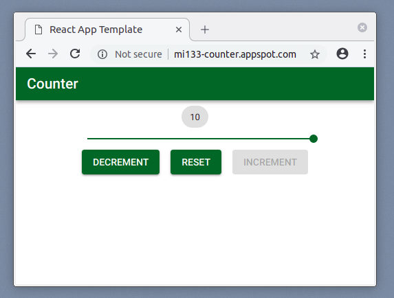


#### LED Matrix

`/led-matrix` 

Simple example of a react app keeping its state in the components.


#### LED Matrix in Plain Redux

`/led-matrix-plain-redux`

Same user flow as `led-matrix` using Redux state container.


#### LED Matrix with Backend

`/led-matrix-with-backend`

Same user flow as `led-matrix` using a backend.


#### LED Matrix with DB

`/led-matrix-with-db`:

Same user flow as `led-matrix` with MongoDB storage.

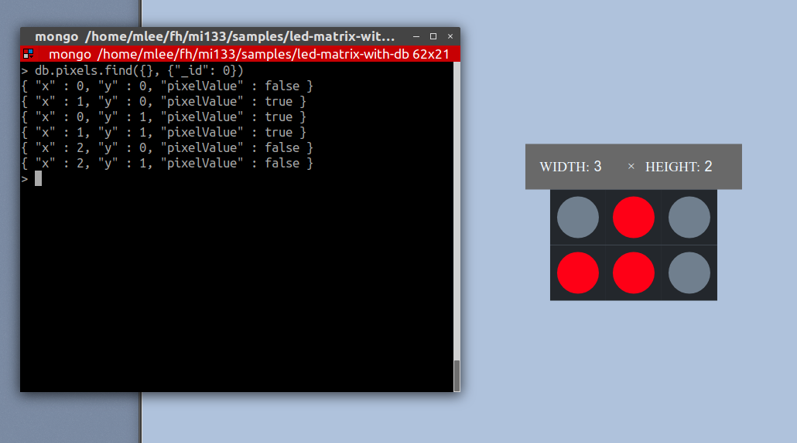


#### Calculator

`/calculator` 

[view app](https://mi133-calculator.appspot.com/)

A calculator lab assignment solution.

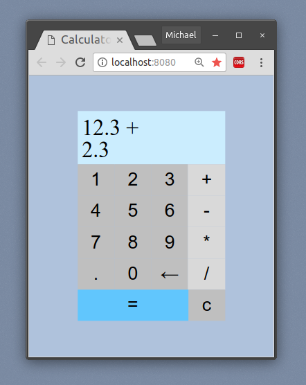


#### Tested Bookmark App

`/bookmarks-with-testing`

A little bookmark app with app logic testing.

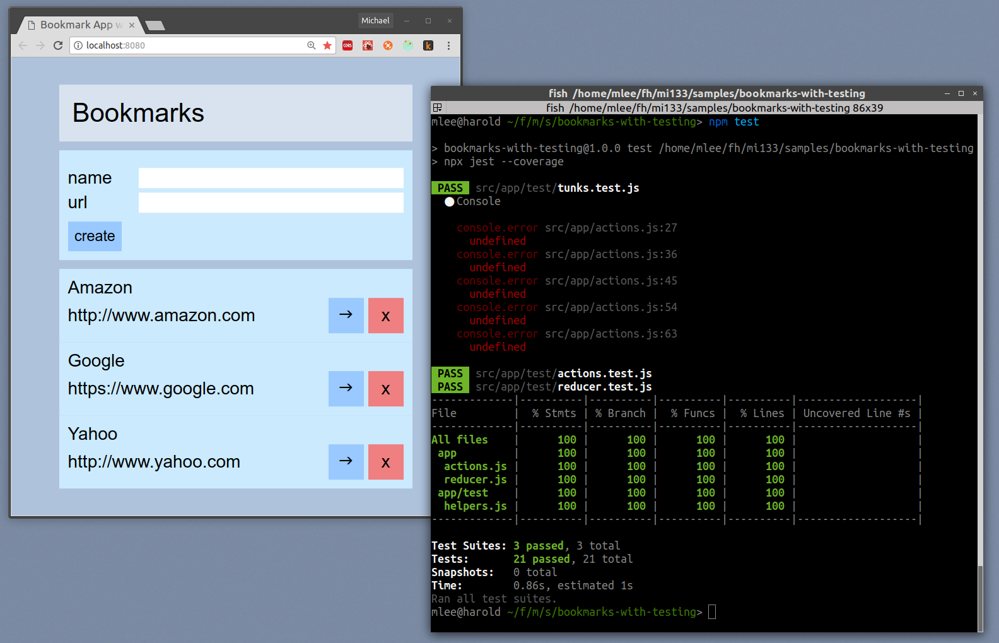


#### Putzplan

`/putzplan`

Backend implementation for the 'Putzplan' lab assignment.

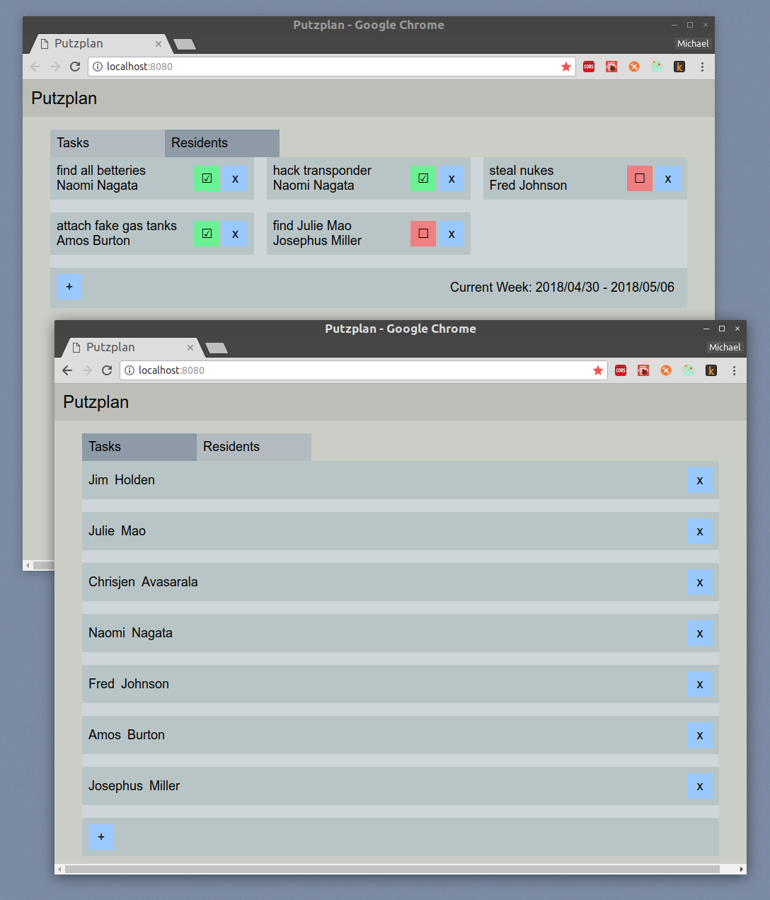

[putzplan docs](/putzplan/README.md)


#### Counter Using Elm

`/infinite-counter`: Very simple click count application to demonstrate the use
of the elm programming language as a real functional alternative to react/redux.

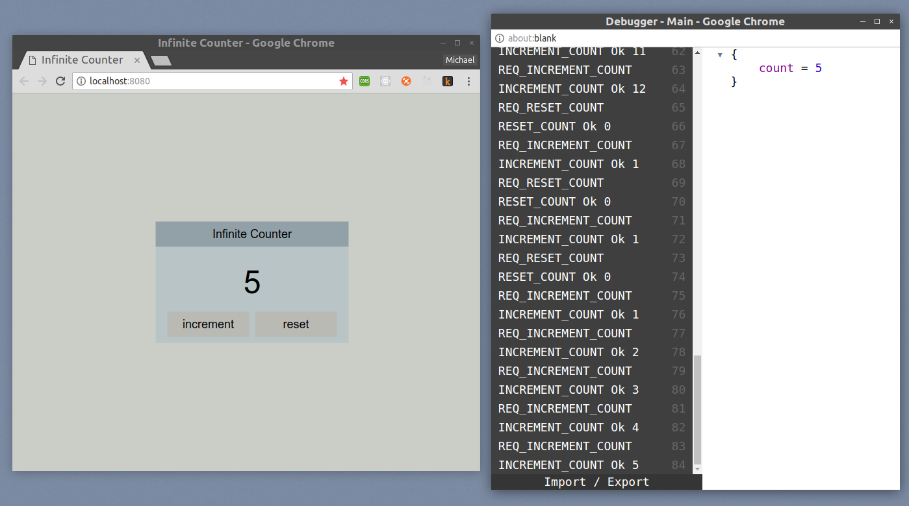


#### Counter Using React

`/infinite-counter-with-react` 

Same as the *inifinite counter* implemented in elm and Koa but implemented using React/Redux
and express.

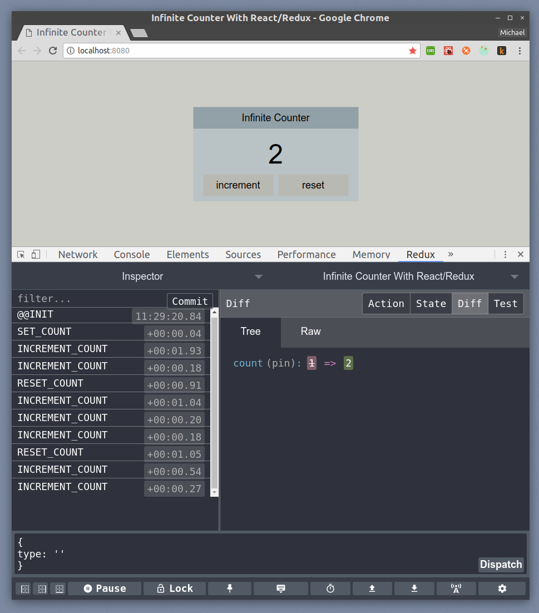


#### Adress Book with Authentication

`/address-book`: A little address book app using passportjs for authentication.

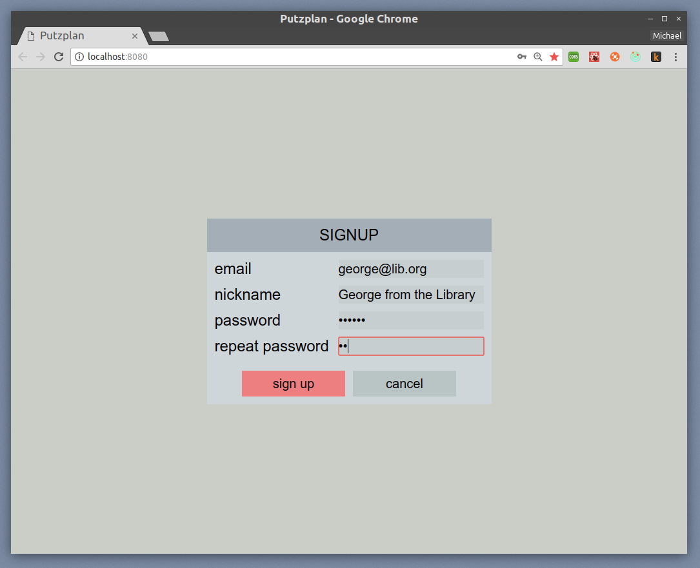
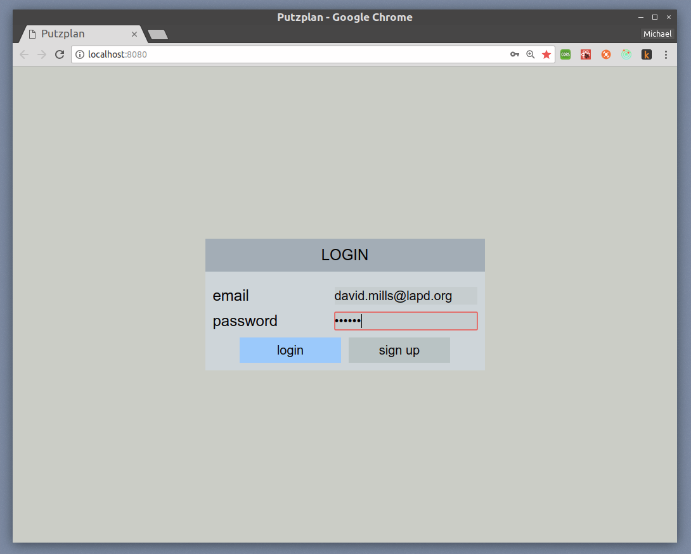
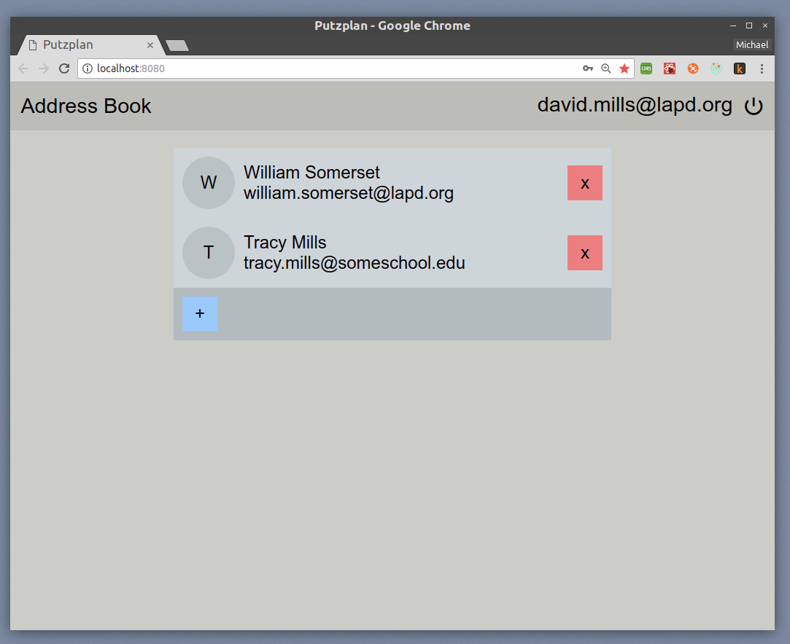
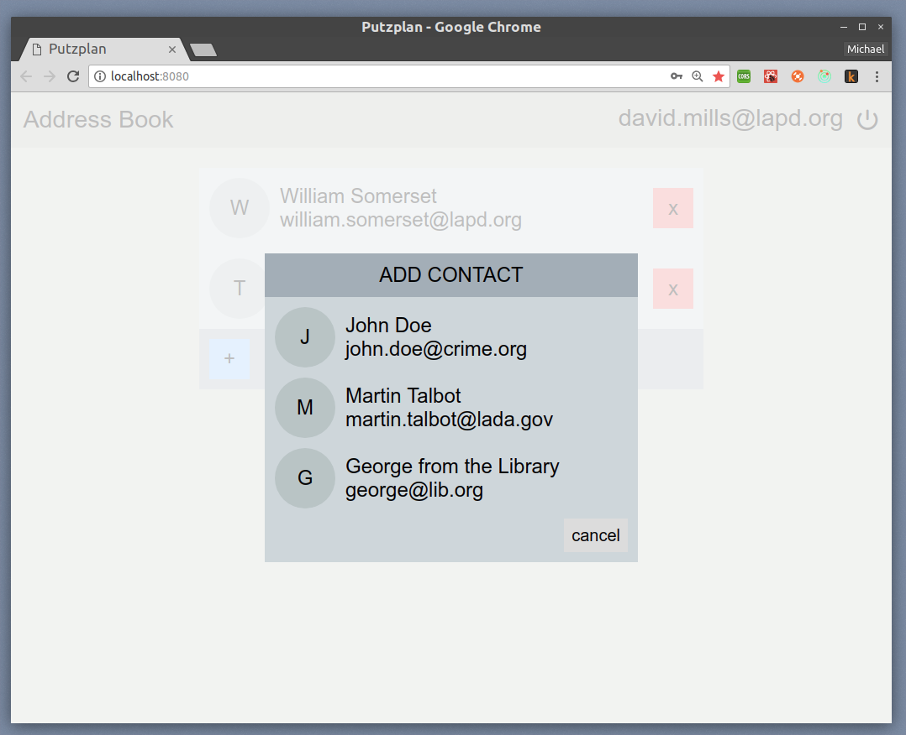
