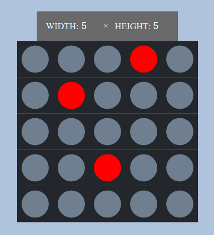
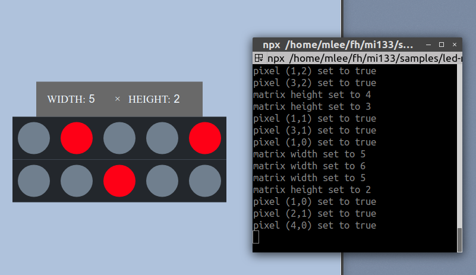

# MI133 Examples

This repo contains the code examples for the MI133 class held in sumer semseter
2018 at FH Kiel.

Each example can be found in a separate subfolder.

### Requirements

You will need to install the following tools:

* **Node.js** JavaScript runtime
* **npm** package manager
* **npx** package runner

### Running Examples:

From an example folder run

```bash
$ npm start
```

to run an example.

### List of examples:

`/led-matrix`: simple example of a react app keeping its state in the components.



`/led-matrix-plain-redux`: same user flow as `led-matrix` using Redux state container.


`/led-matrix-with-backend`: same user flow as `led-matrix` using a backend.


